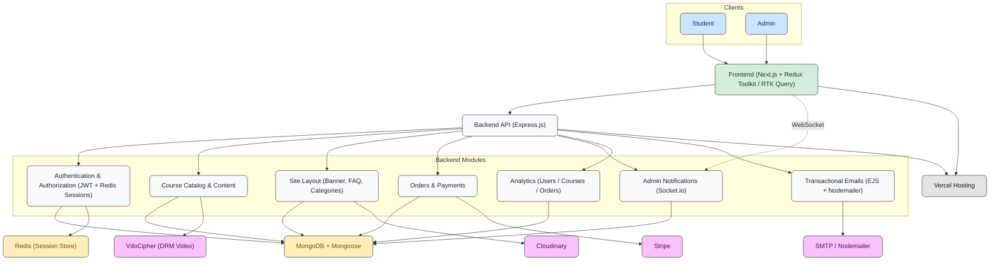
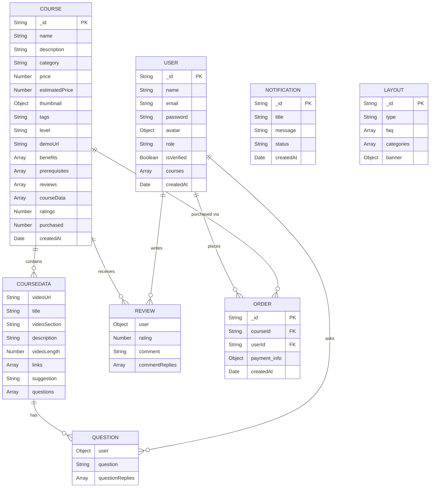
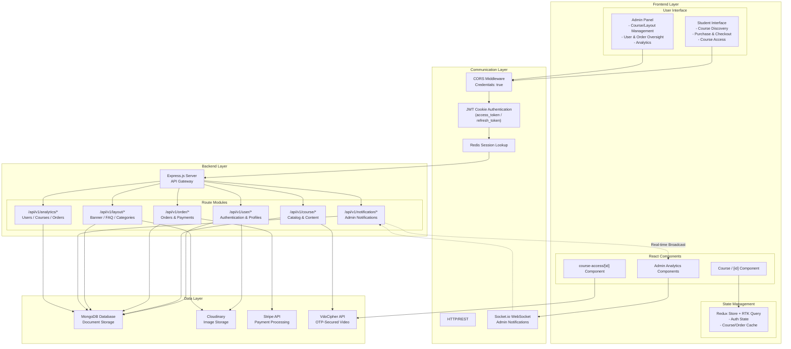
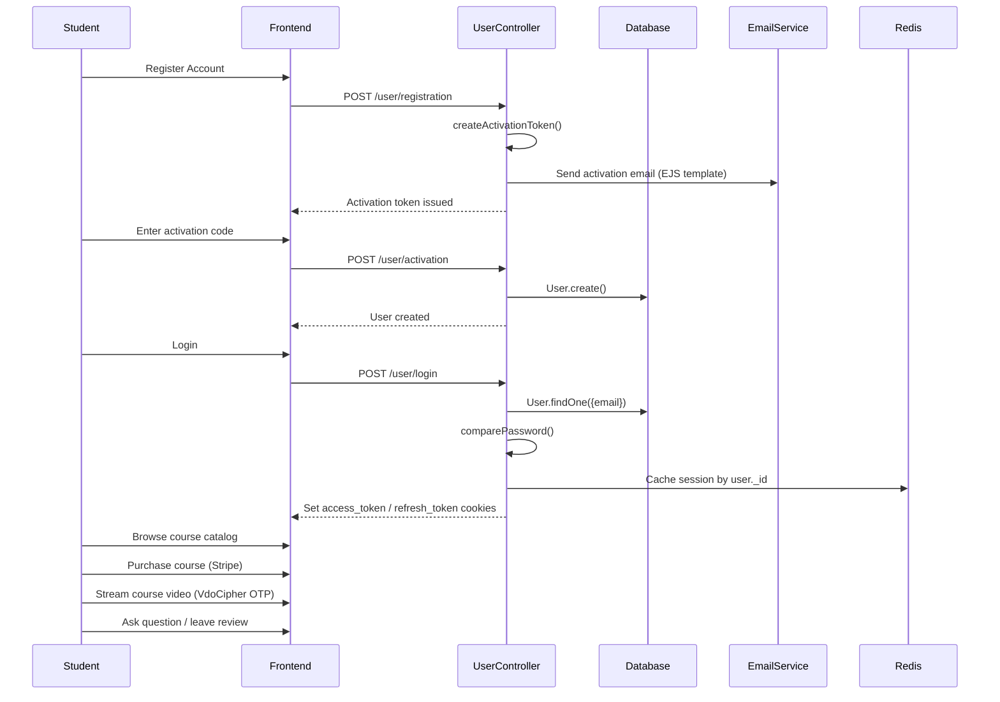
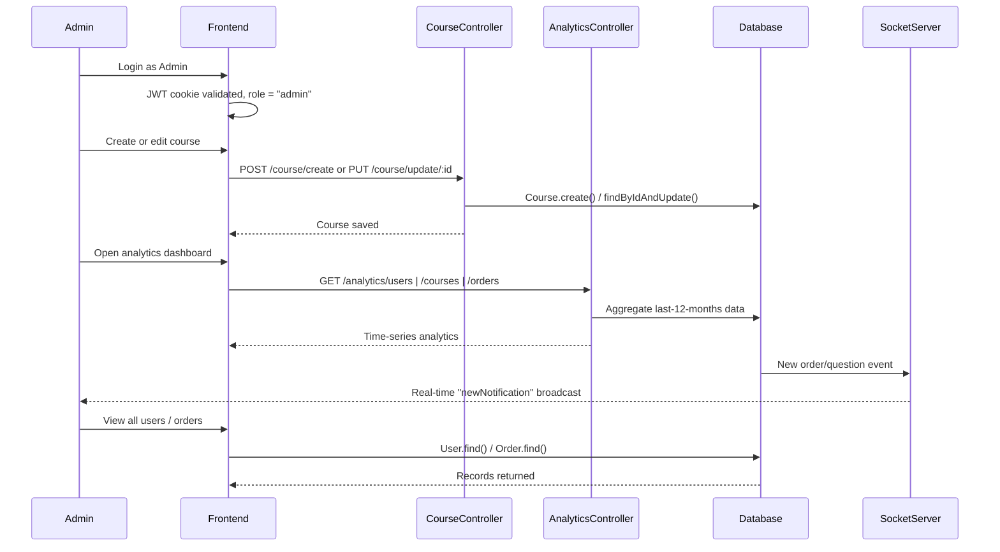

# Complete Case Study - ELearning LMS ([Live App](https://e-learning-lms-xi.vercel.app/) | [Repository](https://github.com/MemonaAmirAbdulHaq/ELearningLMS))

## Overview

The **ELearning LMS** is a full-stack Learning Management System that connects students, instructors, and administrators around a catalog of video-based courses.

o- **Students** can browse the course catalog, purchase courses via Stripe, stream secure course videos, ask questions, leave reviews, and track their enrolled courses from a personal dashboard.

o- **Admins** manage the course catalog, site layout (hero banner, FAQ, categories), users, orders, and view analytics on growth across users, courses, and revenue.

o- **The platform** itself handles authentication, secure video delivery, payments, and notifications end-to-end, with a Redis-backed session layer for fast, stateless API authentication.

The platform integrates **secure DRM video streaming (VdoCipher)**, **Stripe payments**, **Redis session caching**, and **real-time admin notifications over Socket.io** to deliver a complete online learning experience.

---

## Goals of the Project

The **ELearning LMS** is designed to give learners a focused, course-first experience while giving administrators full control over content, pricing, and platform health.

o- **Course-centric learning experience** – Students browse, purchase, and stream structured course content (sections, lessons, links, downloadable resources) with progress gated behind purchase.

o- **Secure content delivery** – Course videos are protected through **VdoCipher's OTP/DRM video API** rather than being served as plain links, preventing unauthorized redistribution.

o- **Frictionless payments** – **Stripe** handles one-time course purchases, with publishable keys served dynamically from the backend so the frontend never hardcodes payment credentials.

o- **Operational visibility for admins** – Dedicated analytics views (`users`, `courses`, `orders`) and a real-time notification feed keep administrators informed of platform activity as it happens.

---

## System Architecture Overview

The platform is built using a modern **full-stack TypeScript architecture** with the following core technologies:

| **Layer**          | **Technology**                       | **Purpose**                                         |
|--------------------|---------------------------------------|------------------------------------------------------|
| Frontend           | Next.js 15 (App Router) + React 19    | Server-rendered UI, routing, and build tooling       |
| UI Library         | MUI 7 + Tailwind CSS 4                | Components, data grids, and utility-first styling    |
| State Management   | Redux Toolkit + RTK Query             | Global state and typed data-fetching/caching layer    |
| Backend            | Express.js 5.1.0 (TypeScript)         | REST API server                                      |
| Database           | MongoDB + Mongoose 8.16.3             | Document storage and ODM                             |
| Session/Cache      | Redis (ioredis)                       | Server-side session store for JWT-issued users       |
| Real-time          | Socket.io                             | Live admin notification broadcasting                  |
| Authentication     | JWT (access + refresh) + bcryptjs     | Token-based auth with hashed passwords               |
| Social Login       | NextAuth.js (Google & GitHub)         | OAuth sign-in on the client                          |
| Video Streaming    | VdoCipher                             | DRM-protected course video playback (OTP-based)       |
| Payments           | Stripe 18.4.0 (+ Stripe.js/React)     | Course purchase processing                            |
| File Storage       | Cloudinary                            | Image upload and storage (avatars, thumbnails, banner)|
| Email              | Nodemailer 7.0.5 + EJS templates       | Transactional emails                                  |
| Scheduling         | node-cron                             | Scheduled background jobs                             |
| Deployment         | Vercel                                | Production hosting (frontend + backend)               |

---

## System Architecture Diagram

---

## Key Features

The **ELearning LMS** offers comprehensive functionality across two main interfaces: **student learning** and **admin platform management**.

### Multi-Role User System

o- **Student Interface**: Course discovery, purchase, secure video playback, Q&A, and reviews
o- **Admin Panel**: Course CRUD, layout management, user management, order oversight, and analytics
o- **Protected Routing**: Role-based middleware (`isAuthenticated`, `authorizeRoles`) restricts admin-only endpoints

### Course Catalog & Content

o- **Course Catalog**: Browse all published courses with category, price, and demo video preview
o- **Structured Course Data**: Each course is broken into video sections, lessons, links/resources, and benefits/prerequisites
o- **Course Access Gating**: Full course content (`/course-access/[id]`) is only served to users with a verified purchase
o- **Q&A on Lessons**: Students can post questions on course content and receive threaded replies from instructors/admins
o- **Reviews & Ratings**: Students leave ratings and comments on purchased courses, with admin reply support

### Secure Video Delivery (VdoCipher)

o- Course videos are streamed through **VdoCipher's OTP API** rather than direct URLs
o- The backend generates a short-lived (5-minute TTL) OTP per video ID, so playback credentials are never exposed or reusable

### Payment Processing

o- Secure one-time course payments through **Stripe**, using **Stripe Elements** on the frontend
o- The backend exposes a dedicated endpoint to fetch the live Stripe publishable key, keeping payment configuration server-driven

### Admin Dashboard Features

o- **Course Management**: Create, edit, and delete courses, including nested video sections and resource links
o- **Layout Management**: Edit the homepage hero banner, FAQ list, and course categories without a redeploy
o- **User Management**: View all users, promote/demote roles, and delete accounts
o- **Order Management**: View all orders platform-wide
o- **Analytics Dashboards**: Time-series views for user growth, course growth, and order/revenue growth
o- **Real-Time Notifications**: New activity is broadcast to connected admins over Socket.io and persisted for the notification panel

### API Architecture

Organized **RESTful API** with endpoints for different business domains:

o- User authentication and profiles: `/api/v1/user/*`
o- Course catalog and content: `/api/v1/course/*`
o- Orders and payments: `/api/v1/order/*`
o- Site layout (banner/FAQ/categories): `/api/v1/layout/*`
o- Notifications: `/api/v1/notification/*`
o- Platform analytics: `/api/v1/analytics/*`

---

## Tech Stack

**Backend:**

**Node.js + TypeScript** – Typed server-side runtime
**Express.js 5** – REST API framework
**MongoDB + Mongoose** – Document storage and schema modeling
**Redis (ioredis)** – Session cache for authenticated users
**JWT** – Short-lived access tokens (5 min) + long-lived refresh tokens (3 days)
**bcryptjs** – Password hashing
**Nodemailer + EJS** – Templated transactional emails (activation, order confirmation, question replies)
**Stripe** – Payment gateway integration
**Axios** – Outbound HTTP calls (e.g., VdoCipher OTP requests)
**node-cron** – Scheduled background jobs
**Socket.io** – Real-time notification broadcasting

**Frontend:**

**Next.js 15 (App Router)** – React framework with server rendering and file-based routing
**React 19** – UI library
**Redux Toolkit + RTK Query** – State management and API data caching
**NextAuth.js** – Google and GitHub OAuth login
**MUI + Tailwind CSS** – Component library and styling
**Formik + Yup** – Form state and validation
**Stripe.js / React Stripe.js** – Embedded payment UI
**Framer Motion** – UI animation
**Recharts** – Admin analytics charts
**react-pro-sidebar** – Admin dashboard navigation
**Socket.io-client** – Real-time notification subscription

**File & Media Handling:**

**Cloudinary** – Cloud-based image storage (avatars, course thumbnails, banner images)

**Video Streaming:**

**VdoCipher** – DRM-protected video hosting and OTP-based playback

**Development & Deployment Tools:**

**ts-node-dev** – Auto-restarting TypeScript dev server
**dotenv** – Environment variable management
**Vercel** – Deployment and hosting for both client and server

---

## Challenges & Solutions

| Challenge | Solution |
|-----------|---------|
| **Exposing raw video URLs would allow content theft** | Integrated VdoCipher's OTP API: the backend requests a short-lived (300s) OTP per `videoId` from VdoCipher rather than ever exposing a direct, reusable video URL. |
| **Stateless JWTs alone don't support instant logout/role changes** | Paired JWTs with a Redis-backed session store — the user's session JSON is cached in Redis on login/refresh and checked on every authenticated request, so revocation and role updates take effect immediately. |
| **Access tokens needed to stay short-lived without forcing frequent logins** | Implemented a refresh-token flow (`updateAccessToken` middleware) that silently re-issues a 5-minute access token from a 3-day refresh token and re-syncs the Redis session, all before the protected route handler runs. |
| **Admins needed live visibility into platform activity** | Added a Socket.io layer where client-side notification events are broadcast to all connected admin sessions in real time, in addition to being persisted to MongoDB for the notification panel. |
| **Payment configuration shouldn't be hardcoded in the frontend** | Exposed a `/payment/stripepublishablekey` endpoint so the Stripe publishable key is fetched at runtime from the backend rather than baked into the client bundle. |
| **Course content has deeply nested, variable-shape data (sections, links, Q&A threads, reviews)** | Modeled courses with nested Mongoose sub-schemas (`courseData`, `linkSchema`, `commentSchema`, `reviewSchema`) so questions, replies, and reviews live inside the course document itself. |
| **Supporting both credentials-based and social login** | Combined a custom JWT/bcrypt flow for email/password with NextAuth.js (Google and GitHub providers) for OAuth, unified through a `social-auth` backend endpoint. |
| **Rate limiting and abuse prevention on a public API** | Applied `express-rate-limit` (100 requests per 15 minutes per IP) at the application level ahead of the error-handling middleware. |
| **Restricting admin-only operations (course CRUD, analytics, user management)** | Built a composable `authorizeRoles(...roles)` middleware layered after authentication, so each route declares exactly which roles may access it. |

---

## Database Design

---

## Application Flow Diagram

---

## Student Flow

---

## Admin Flow

---

## Best Practices

### Authentication & Security
o- **JWT tokens stored in HTTP-only cookies** (`access_token`, `refresh_token`) to prevent XSS-based token theft.
o- **Dual-token strategy**: short-lived (5 min) access tokens paired with longer-lived (3-day) refresh tokens, refreshed transparently via middleware.
o- **Redis-backed sessions** so authentication checks don't rely solely on token state, enabling fast invalidation.
o- **Password hashing with bcryptjs**, with passwords excluded from query results by default (`select: false`).
o- **Role-based authorization** (`authorizeRoles`) layered on top of authentication for admin-only routes.
o- **API rate limiting** (`express-rate-limit`) to mitigate abuse on public endpoints.

### Component Architecture
o- **App Router structure** in Next.js separating student-facing routes (`/course`, `/courses`, `/profile`) from admin routes (`/admin/*`).
o- **RTK Query slices per domain** (auth, course, order, layout, notification, analytics) for typed, cached data fetching.
o- **Protected route components** enforcing role checks before rendering admin pages.

### Error Handling & User Experience
o- **Centralized error middleware** (`ErrorMiddleware`) and a `CatchAsyncError` wrapper around controllers to avoid repetitive try/catch blocks.
o- **Custom `ErrorHandler`** class for consistent, typed API error responses.
o- **Toast notifications** (react-hot-toast) for immediate feedback on actions like purchases, reviews, and form submissions.
o- **Form validation** with Formik + Yup for registration, login, and course-creation forms.

---

## Conclusion

The ELearning LMS stands out as a focused, production-ready learning platform built around three core concerns: **protecting course content**, **processing payments cleanly**, and **giving administrators real-time operational visibility**. By pairing JWT authentication with a Redis session layer, gating video playback behind VdoCipher's OTP API, and exposing dedicated analytics and notification systems for admins, the platform demonstrates a security-conscious, full-stack TypeScript architecture that is well-prepared for real-world course delivery at scale.
